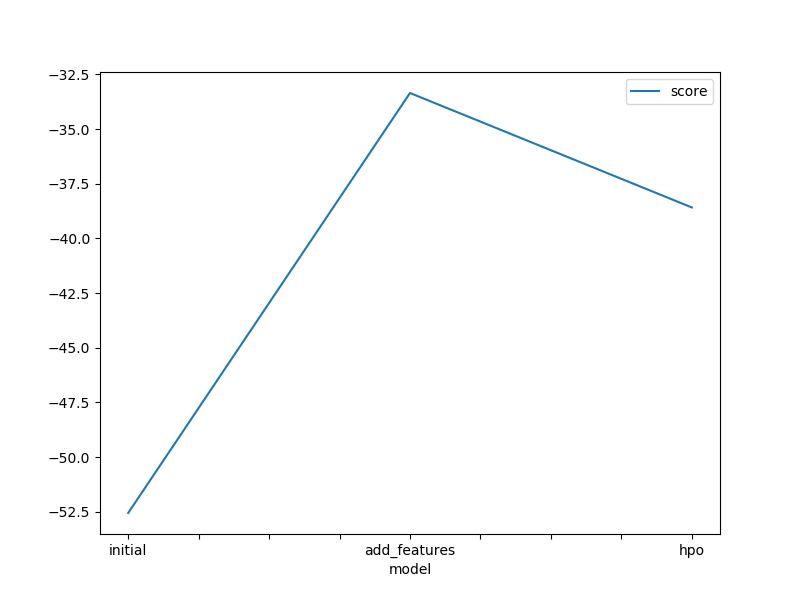
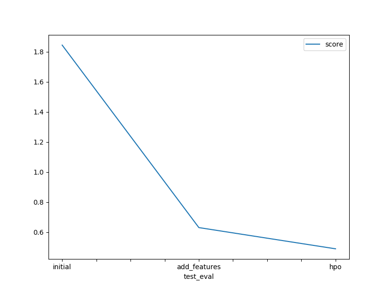

# Predict Bike Sharing Demand with AutoGluon
Kushagra Srivastava

## Results and Conclusion

### Initial Training
- The top-ranked model that performed well was the "WeightedEnsemble_L3" model without hyperparameter tuning as score fell after the tuning process.

### Exploratory Data Analysis and Feature Creation
New features were generated by extracting the hour, day, month, and year from the DateTime feature. Certain features were also transformed into categorical variables. However, incorporating these additional features did not result in a substantial improvement in the performance of the models.

### Hyperparameter Tuning
- It didn't help much. Score decreased after doing it.

### Future Considerations
- We can create more features and try to find new relations/trends to work on.

### Model Comparison and Kaggle Scores
- A comparison table was generated to analyze the different models, the modified hyperparameters, and the corresponding Kaggle scores. The highest performing model achieved a Kaggle score of 1.84484 and was identified as the "WeightedEnsemble_L3".

### Training and Kaggle Scores

### Prediction Submissions

## Summary
The project's goal was to predict bike rental demand for a rental company using the AutoGluon solution. The machine learning (ML) process involved several stages: understanding the problem, manipulating data, engineering features, building and testing models. The objective was to increase the company's profitability and customer satisfaction by accurately forecasting the required number of bike trips.

During the initial training, it was observed that submitting negative predictions (-) was not allowed, so those values were adjusted to 0. The best-performing model was the "WeightedEnsemble_L3" without hyperparameter tuning.

Exploratory data analysis provided insights that helped in creating additional features. Time-related features such as hour, day, month, and year were extracted from the DateTime feature, and certain variables were converted into categorical form. However, these new features did not significantly improve the model's performance.

Hyperparameter tuning was conducted, but it did not lead to improved performance and, in some cases, even resulted in decreased performance.

With more time and data, the focus would be on generating more synthetic features to enhance the predictive capabilities of the models.

The project involved multiple model runs with different hyperparameters, and a table was created to summarize the models, hyperparameters, and corresponding Kaggle scores.

The project's findings and results were visualized through line plots that displayed the top model score during training runs and the top Kaggle scores achieved during prediction submissions.

Overall, the project provided valuable insights into predicting bike rental demand and highlighted the importance of feature engineering, model selection, and hyperparameter tuning in achieving accurate predictions.